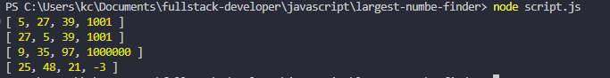

# Largest Number Finder — Trouver le Plus Grand Nombre dans Chaque Sous-Tableau

Ce projet consiste à créer une fonction capable de **retrouver le plus grand nombre dans chaque sous-tableau** d’un tableau principal. 
À partir d’un tableau contenant d’autres tableaux (appelés sous-tableaux), le programme parcourt chacun d’eux et en extrait la valeur maximale.


---

## Description du projet

Le programme définit plusieurs tableaux contenant eux-mêmes des sous-tableaux d'entiers.
Il transmet chaque sous-tableau à une fonction `largestOfAll()` qui :

1. Parcourt chaque sous-tableau,
2. Recherche le plus grand nombre,
3. Ajoute ce nombre à un tableau final.

Le script affiche ensuite les résultats dans la console.

La fonction utilise **des boucles for imbriquées** pour comparer chaque valeur.


---

## Objectifs du projet

- Manipuler des tableaux multidimensionnels
- Utiliser des boucles imbriquées
- Comparer des valeurs pour trouver un maximum
- Créer une fonction générique et réutilisable
- Stocker et retourner un nouveau tableau de résultats
- Afficher proprement les résultats dans la console


---

## Fonctionnement du programme

- Déclaration de plusieurs tableaux de test (`arr`, `arr1`, `arr2`, `arr3`)
- Définition de la fonction principale `largestOfAll(arrays)`
- Initialisation d’une variable `largestNumber`
- Parcours de chaque sous-tableau
- Comparaison de chaque valeur pour conserver la plus grande
- Ajout du résultat au tableau `largestArray`
- Appel de la fonction et affichage des résultats dans la console

---

## Aperçu du résultat

Voici un aperçu du résultat visible dans la console :



---

## Compétences acquises
  
- Manipulation de tableaux (simples et multidimensionnels)
- Comparaison de valeurs
- Boucles imbriquées
- Conception d’une fonction réutilisable
- Tests et débogage dans la console
- Organisation d’un projet JavaScript simple

---

## Technologies utilisées

| Technologie | Description |
|--------------|-------------|
| **JavaScript (ES6+)** | Langage utilisé pour le script |
| **Node.js** | Environnement d’exécution |
| **VS Code** | Éditeur de code utilisé |

---

##  Lancer le projet

1. **Cloner le dépôt GitHub :**
   ```bash
   git clone https://github.com/idriss-enone/largest-number-finder.git 

2. **Ouvrir le projet :**

  - Ouvrir le dossier dans **VS Code**.
  - Ouvrir le fichier `script.js`.

3. **Exécuter le code :**
    - Via la console du navigateur dans une page HTML liée au script ;
    - Ou via Node.js :
      ```bash
      node script.js

---

## Auteur
Projet réalisé par **Idriss Enone** dans le cadre d’un apprentissage en JavaScript.

---
